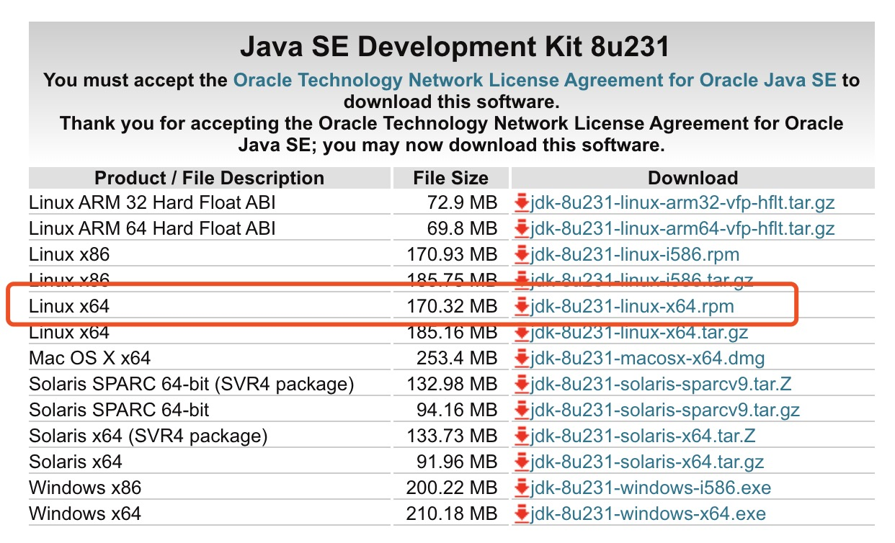
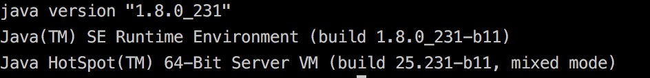

<!--
 * @Author: your name
 * @Date: 2019-12-04 11:42:09
 * @LastEditTime: 2019-12-04 21:39:59
 * @LastEditors: Please set LastEditors
 * @Description: In User Settings Edit
 * @FilePath: /Intergrated Environment Based on Jekins/README.md
 -->
# 基于CentOS的集成环境搭建过程(Jenkins + maven + git + junit + selenium + SonarQube)

* [基于CentOS的集成环境搭建过程(Jenkins   maven   git   junit   selenium   SonarQube)](#基于centos的集成环境搭建过程jenkins--maven--git--junit--selenium--sonarqube)
    * [系统环境](#系统环境)
        * [远程环境](#远程环境)
        * [本地环境](#本地环境)
    * [准备工作](#准备工作)
    * [Java环境配置](#java环境配置)
    * [Jenkins环境配置](#jenkins环境配置)
    * [Maven配置](#maven配置)
    * [git配置并上传代码](#git配置并上传代码)
    * [Junit配置](#junit配置)
    * [Selenium环境配置](#selenium环境配置)
    * [SonarQube环境配置](#sonarqube环境配置)
    * [参考文献](#参考文献)

## 系统环境

### 远程环境
+ 阿里云：云服务器ECS
+ CPU： 1核
+ 内存： 4 GiB (记住一定要4GiB及以上)
+ 操作系统：CentOS 7.3 64位

### 本地环境
+ 操作系统：macOS High Sierra 10.13.6

## 准备工作
+ 创建专门用于存储安装包的目录, 目录路径为 **/home/developer/package**
+ 文中出现的 **{...}** 都是敏感信息

## Java环境配置
+ Java版本：jdk1.8


+ 使用sftp协议上传至云服务器中，路径为 **/home/developer/package**
```
sftp> put /Users/{...}/Downloads/jdk-8u231-linux-x64.rpm /home/developer/package
```

+ 进入 **/home/developer/package** , 使用rpm命令安装jdk
```
[root@{...} package]# cd /home/developer/package
[root@{...} package]# rpm -ivh jdk-8u231-linux-x64.rpm
# JDK默认安装在/usr/java中
```

+ 进入 **/usr/java/** ，将目录 **jdk1.8.0_231-amd64** 改名为 **jdk1.8.0_231**
```
[root@{...} package]# cd /usr/java
[root@{...} java]# mv jdk1.8.0_231-amd64 jdk1.8.0_231
```

+ 配置环境变量
```
[root@{...} java]# vi /etc/profile
# 添加以下内容， 最好在内容的前一行加个备注，以便区别后面配置如 Maven 的环境变量
JAVA_HOME=/usr/java/jdk1.8.0_231
JRE_HOME=/usr/java/jdk1.8.0_231/jre
PATH=$PATH:$JAVA_HOME/bin:$JRE_HOME/bin
export PATH
```

+ 执行修改并验证
```
[root@{...} java]# source /etc/profile
[root@{...} java]# java -verison
```
输出以下内容即成功：


## Jenkins环境配置
(待添加)

## Maven配置
(待添加)

## git配置并上传代码
(待添加)

## Junit配置
(待添加)

## Selenium环境配置
(待添加)

## SonarQube环境配置
(待添加)

## 参考文献
(待添加)