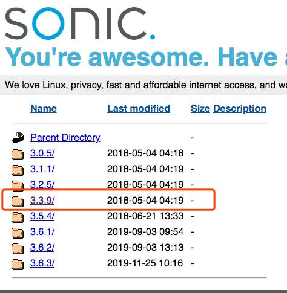

<!--
 * @Author: your name
 * @Date: 2019-12-04 11:42:09
 * @LastEditTime: 2019-12-04 21:39:59
 * @LastEditors: Please set LastEditors
 * @Description: In User Settings Edit
 * @FilePath: /Intergrated Environment Based on Jekins/README.md
 -->
# 基于CentOS的集成环境搭建过程(Jenkins + maven + git + junit + selenium + SonarQube)

* [基于CentOS的集成环境搭建过程(Jenkins   maven   git   junit   selenium   SonarQube)](#基于centos的集成环境搭建过程jenkins--maven--git--junit--selenium--sonarqube)
    * [系统环境](#系统环境)
        * [远程环境](#远程环境)
        * [本地环境](#本地环境)
    * [准备工作](#准备工作)
    * [Java环境配置](#java环境配置)
    * [Jenkins环境配置](#jenkins环境配置)
    * [Maven配置](#maven配置)
    * [git配置并上传代码](#git配置并上传代码)
    * [Junit配置](#junit配置)
    * [Selenium环境配置](#selenium环境配置)
    * [SonarQube环境配置](#sonarqube环境配置)
    * [参考文献](#参考文献)

## 系统环境

### 远程环境
+ 阿里云：云服务器ECS
+ CPU： 1核
+ 内存： 4 GiB (记住一定要4GiB及以上)
+ 操作系统：CentOS 7.3 64位

### 本地环境
+ 操作系统：macOS High Sierra 10.13.6

## 相关介绍

### Jenkins

### Maven

### git

### Selenium

### SonarQube

## 准备工作
+ 创建专门用于存储安装包的目录, 目录路径为 **/home/developer/package**
+ 文中出现的 **{...}** 都是敏感信息

## Java环境配置
+ Java版本：jdk1.8


+ 使用sftp协议上传至云服务器中，路径为 **/home/developer/package**
```
sftp> put /Users/{...}/Downloads/jdk-8u231-linux-x64.rpm /home/developer/package
```

+ 进入 **/home/developer/package** , 使用rpm命令安装jdk
```
[root@{...} package]# cd /home/developer/package
[root@{...} package]# rpm -ivh jdk-8u231-linux-x64.rpm
# JDK默认安装在/usr/java中
```

+ 进入 **/usr/java/** ，将目录 **jdk1.8.0_231-amd64** 改名为 **jdk1.8.0_231**
```
[root@{...} package]# cd /usr/java
[root@{...} java]# mv jdk1.8.0_231-amd64 jdk1.8.0_231
```

+ 配置环境变量
```
[root@{...} java]# vi /etc/profile
# 添加以下内容， 最好在内容的前一行加个备注，以便区别后面配置如 Maven 的环境变量
JAVA_HOME=/usr/java/jdk1.8.0_231
JRE_HOME=/usr/java/jdk1.8.0_231/jre
PATH=$PATH:$JAVA_HOME/bin:$JRE_HOME/bin
export PATH
```

+ 执行修改并验证
```
[root@{...} java]# source /etc/profile
[root@{...} java]# java -verison
```
输出以下内容即成功：


## Jenkins环境配置

+ Jenkins版本：jenkins-2.190.3-1.1（https://pkg.jenkins.io/redhat-stable/）


+ 使用sftp协议上传至云服务器中，路径为 **/home/developer/package**
（命令同上）

+ 进入 **/home/developer/package** , 使用rpm命令安装jdk
（命令同上）

+ 修改端口和Java执行路径（可选）
```
[root@{...} package]# vi /etc/sysconfig/jenkins
# 修改 JENKINS_JAVA_CMD="/usr/java/jdk1.8.0_231/bin/java"
# 修改 JENKINS_PORT="8080" (可选；如果端口冲突的话)
```

+ 启动Jenkins
```
# 可执行命令: service jenkins start/stop/restart
[root@{...} package]# service jenkins start
Starting jenkins (via systemctl):                          [  OK  ]
```

+ 进入云服务器控制台，配置防火墙，添加端口过滤规则


+ 浏览器请求 **{云服务器ip}:8080**

 
+ 复制云服务器中 ** /var/lib/jenkins/secrets/initialAdminPassword ** 的密码
```
[root@{...} package]# cat /var/lib/jenkins/secrets/initialAdminPassword
```

+ 点击安装推荐的插件即可


+ 创建管理员用户，密码设置的复杂点，以后都要用此登录的


+ 进入界面后，即完成Jenkins的安装


+ Jenkins配置JDK  
进入 **Manage Jenkins -> Global Tool Configuration**，配置JDK环境

可以通过执行 **echo $JAVA_HOME** 查看JDK路径

## Maven配置

+ Maven版本：3.3.9（http://mirrors.sonic.net/apache/maven/maven-3）


+ 选择binaries压缩文件，用wget在云服务器上直接下载
```
[root@{...} package]# wget http://mirrors.sonic.net/apache/maven/maven-3/3.3.9/binaries/apache-maven-3.3.9-bin.tar.gz
# 可能会有点慢，可以采用sftp在本地下载再上传上去
```

+ 使用tar命令将Maven解压至/usr/maven3中，并重命名
```
[root@{...} package]# mkdir /usr/maven3
[root@{...} package]# tar xzf apache-maven-3.3.9-bin.tar.gz -C /usr/maven3/
[root@{...} package]# mv /usr/maven3/apache-maven-3.3.9 /usr/maven3/maven-3.3.9
```

+ 配置环境变量
```
[root@{...} package]# vi /etc/profile
# 添加以下内容， 最好在内容的前一行加个备注，以便区别后面配置的环境变量
MAVEN_HOME=/usr/maven3/maven-3.3.9
PATH=$PATH:$MAVEN_HOME/bin
export MAVEN_HOME
export PATH
```

+ 执行修改并验证
```
[root@{...} package]# source /etc/profile
[root@{...} package]# mvn -v
```
输出以下内容即成功：


+ Jenkins配置Maven  
进入 **Manage Jenkins -> Global Tool Configuration**，配置Maven环境

可以通过执行 **echo $MAVEN_HOME** 查看MAVEN_HOME路径

## git配置并上传代码

+ git版本：2.8.0

+ 使用wget直接在云服务器上下载
```
[root@{...} package]# wget https://www.kernel.org/pub/software/scm/git/git-2.8.0.tar.gz
```

+ 在相关依赖
```
[root@{...} package]# yum -y install zlib-devel openssl-devel cpio expat-devel curl-devel
```

+ 解压git
```
[root@{...} package]# tar -zxvf git-2.8.0.tar.gz
```

+ 编译
```
[root@{...} package]# cd git-2.8.0
[root@{...} git-2.8.0]# make configure
# 出现 /bin/sh: autoconf: 未找到命令 错误
[root@{...} git-2.8.0]# yum install autoconf
[root@{...} git-2.8.0]# make configure
[root@{...} git-2.8.0]# ./configure
[root@{...} git-2.8.0]# make
# 出现  make[1]: *** [perl.mak] 错误 2 
# make: *** [perl/perl.mak] 错误 2 错误
[root@{...} git-2.8.0]# yum install perl-ExtUtils-MakeMaker package
[root@{...} git-2.8.0]# make
[root@{...} git-2.8.0]# make install
[root@{...} git-2.8.0]# echo "export PATH=$PATH:/usr/local/git/bin" >> /etc/bashrc
[root@{...} git-2.8.0]# source /etc/bashrc
[root@{...} git-2.8.0]# git --version
```
输出git版本号则配置成功

+ Jenkins配置git  
进入 **Manage Jenkins -> Global Tool Configuration**，配置git环境

可以通过执行 **which git** 查看git可执行文件

## 创建新任务，并使用JUint测试

+ 测试代码  
将https://github.com/jenkins-docs/simple-java-maven-app中的代码fork到自己的仓库中。

+ Jenkins安装Maven插件  
在Jenkins中，**Manage Jenkins -> Manage Plugins** 


+ 点击 创建一个新任务


+ 在配置中，选择GitHub项目，以及**源码管理**中添加Git仓库管理


+ 点击保存 -> 立即构建 -> 控制台输出查看信息


## Selenium环境配置
(待添加)

## SonarQube环境配置
(待添加)

## 参考文献

+ Java环境配置
https://www.jianshu.com/p/fe69558cb504

+ Jenkins环境配置
https://blog.csdn.net/Paulangsky/article/details/88226626

+ Maven环境配置
https://yq.aliyun.com/articles/44689

+ 阿里云ECS服务器安装git
https://www.jianshu.com/p/279ca6b455d7

+ Jenkins Maven插件安装
http://istester.com/jenkins/189.html